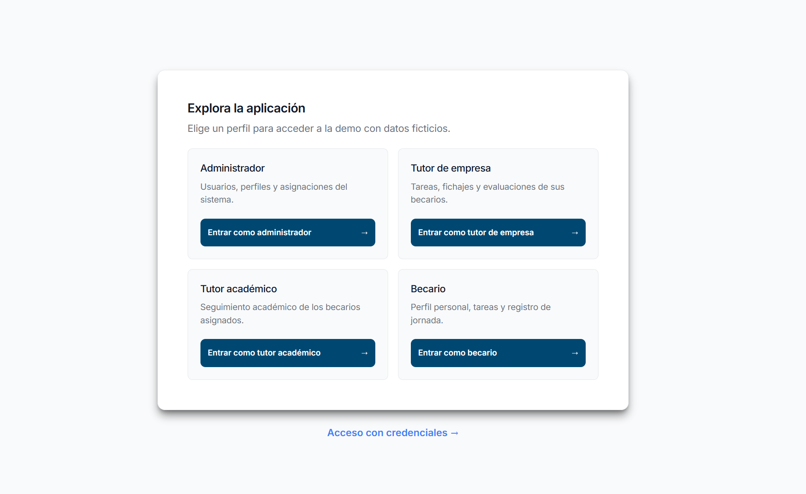
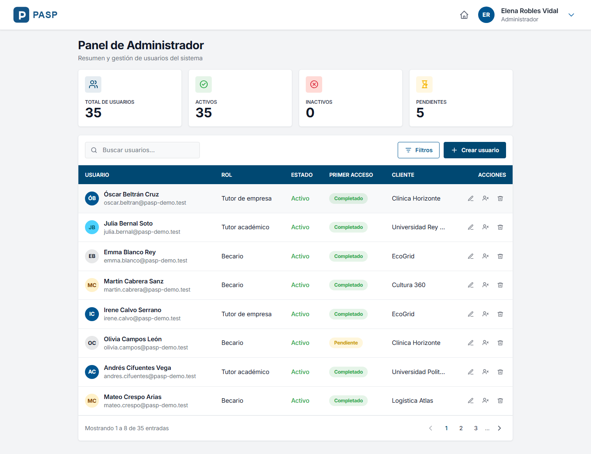
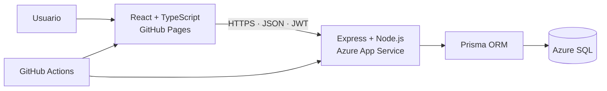

# PASP — Plataforma de Administración y Seguimiento de Prácticas


PASP es una aplicación web full stack para centralizar la administración y el
seguimiento de prácticas formativas. Integra usuarios, asignaciones entre
tutores y becarios, tareas, fichajes y evaluaciones en una experiencia adaptada
a cada rol.

**[Explorar la demo pública](https://luiscastanoq.github.io/pasp/)**

> La demo contiene exclusivamente datos ficticios. Los perfiles públicos son de
> consulta: permiten recorrer paneles y formularios, pero la API rechaza cualquier
> operación de escritura y explica que el cambio no se ha aplicado.

## Mi aportación

Soy **Luis Alberto Castaño Quero**, autor de PASP. Desarrollé la aplicación durante
mis prácticas estudiantiles en respuesta a una necesidad de **ViewNext**. Mi
aportación comprende el desarrollo del frontend y la API, las decisiones de
producto y arquitectura, y la revisión de los cambios realizados con apoyo de IA.

Después adapté el proyecto, con autorización, a esta demo pública: identidad
propia, datos ficticios, acceso por roles, bloqueo de escrituras en el servidor
y despliegue en GitHub Pages y Azure.



## Qué problema resuelve

El seguimiento de prácticas requiere coordinar información que normalmente se
reparte entre distintas personas y herramientas. PASP ofrece un único punto para:

- administrar usuarios y sus relaciones;
- asignar tutores de empresa y académicos a cada becario;
- organizar tareas y consultar su evolución;
- registrar y revisar jornadas de trabajo;
- crear y consultar evaluaciones;
- mostrar a cada persona solo las funciones asociadas a su rol.

## Perfiles disponibles

La pantalla **Explora la aplicación** permite acceder sin credenciales a cuatro
recorridos representativos:

| Perfil | Qué permite explorar |
| --- | --- |
| Administrador | Usuarios, perfiles, asignaciones y visión general del sistema. |
| Tutor de empresa | Becarios asignados, tareas, fichajes y evaluaciones. |
| Tutor académico | Seguimiento académico de los becarios asignados. |
| Becario | Perfil, tareas y registro de jornada. |

El formulario de credenciales se mantiene para la cuenta privada de
superadministración. Esa cuenta no aparece en listados, detalles ni estadísticas
de las sesiones demo.



## Aspectos técnicos destacados

- SPA responsive construida con React, TypeScript, Vite y CSS Modules.
- API REST con Express, validación mediante Zod y acceso a datos con Prisma.
- Autenticación JWT y autorización aplicada en el servidor según el rol.
- Relaciones entre administradores, tutores de empresa, tutores académicos y becarios.
- Historial de tareas, fichajes con paginación y evaluaciones por criterios.
- Manejo uniforme de errores, identificadores de petición y logs estructurados.
- Preparación ante el arranque en frío de Azure SQL desde la pantalla de acceso.
- Semilla reproducible y protegida para reconstruir el entorno ficticio.
- Despliegues automáticos de frontend y backend desde GitHub Actions.

## Arquitectura y despliegue



| Componente | Tecnología | Entorno público |
| --- | --- | --- |
| Frontend | React 19, TypeScript, Vite, React Router | GitHub Pages |
| Backend | Node.js 24, Express 5, TypeScript | Azure App Service |
| Persistencia | Prisma ORM, Microsoft SQL Server | Azure SQL |
| Automatización | GitHub Actions | Compilación y despliegue desde `main` |

El frontend utiliza `HashRouter`, adecuado para un alojamiento estático. La API
es la frontera de seguridad: valida las entradas, comprueba la autenticación y
los permisos, y aplica las reglas de negocio antes de acceder a SQL Server.

## Seguridad de la demostración

- Los botones por rol no publican correos ni contraseñas.
- Las contraseñas de las cuentas demo se generan aleatoriamente al aplicar la
  semilla; solo se conserva su hash y el valor en claro se descarta.
- Los tokens demo caducan a los 30 minutos; las sesiones privadas, a las 2 horas.
- El navegador conserva la autenticación en `sessionStorage`, limitada a la
  pestaña actual.
- Las escrituras de una sesión demo se rechazan en la API antes de llegar a los
  controladores.
- El superadministrador conserva sus permisos completos mediante credenciales
  privadas y queda oculto para los visitantes.
- Los tutores solo pueden consultar los becarios que tienen asignados.
- Helmet, CORS con origen explícito y límites de peticiones reducen la superficie
  expuesta de la API pública.
- La base publicada está reservada para datos ficticios del dominio
  `pasp-demo.test`.

La demo sirve para evaluar el producto y la implementación. No está destinada a
tratar información personal real ni a sustituir un despliegue empresarial.

## Desarrollo asistido por IA

Utilicé **Cline y Codex** como apoyo a la ingeniería y **Stitch** para el diseño
de interfaces. Tres prácticas organizan la explicación del proceso:

1. **Requisitos y trazabilidad:** la [SPEC-022](specs/spec-022.md) conecta reglas
   y criterios de aceptación con el código de la demo. Es una reconstrucción
   retrospectiva; no acredita una especificación previa a la implementación.
2. **Contexto y supervisión humana:** [AGENTS.md](AGENTS.md) define las reglas
   vigentes; la [memoria de Cline](.cline/memory/) conserva contexto histórico.
   Las decisiones de producto, permisos y publicación corresponden al autor.
3. **Verificación independiente:** los [workflows](.github/workflows/) ejecutan
   lint, pruebas y compilación antes del despliegue. Sus resultados permiten
   contrastar las propuestas de IA con controles automatizados.

La [guía de desarrollo asistido por IA](docs/AI-SDD.md) detalla las herramientas,
las evidencias conservadas y el ciclo SDD propuesto para continuar el proyecto.

## Ejecución local

### Requisitos

- Node.js 24.x y npm.
- Una instancia accesible de Microsoft SQL Server.
- Una base de datos y un usuario con permisos para aplicar las migraciones.

### Backend

```bash
cd backend
npm ci
```

Crea `backend/.env` a partir de `backend/.env.example`:

```dotenv
NODE_ENV=development
PORT=3001
FRONTEND_URL=http://localhost:5173
DATABASE_URL="sqlserver://SERVIDOR:1433;database=PASP;user=USUARIO;password=CONTRASENA;encrypt=true;trustServerCertificate=true"
JWT_SECRET="SUSTITUIR_POR_UN_SECRETO_LARGO_Y_ALEATORIO"
JWT_EXPIRES_IN=2h
DEMO_JWT_EXPIRES_IN=30m
PASP_DEMO_MODE=false
```

Después, aplica las migraciones e inicia la API:

```bash
npm run migrate:deploy
npm run dev
```

El comando `npm run dev` utiliza el modo `--watch` de Node.js 24 para reiniciar
la API cuando cambian los archivos cargados, y conserva `ts-node --files` para
ejecutar TypeScript en desarrollo.

La API estará disponible en `http://localhost:3001`; su endpoint básico de
salud es `http://localhost:3001/api/v1/health`.

### Frontend

En otra terminal:

```bash
cd frontend
npm ci
npm run dev
```

En desarrollo, el frontend utiliza por defecto
`http://localhost:3001/api/v1`. Para seleccionar otra API, define
`VITE_API_URL` en un archivo de entorno local del frontend.

## Comandos habituales

Los comandos se ejecutan dentro de `backend/` o `frontend/`:

| Acción | Backend | Frontend |
| --- | --- | --- |
| Desarrollo | `npm run dev` | `npm run dev` |
| Compilación | `npm run build` | `npm run build` |
| Análisis estático | `npm run lint` | `npm run lint` |
| Pruebas | `npm test` | `npm test` |
| Cobertura | `npm run test:coverage` | `npm run test:coverage` |
| Formato | `npm run format:check` | `npm run format:check` |
| E2E | — | `npm run test:e2e` |

## Estructura del repositorio

```text
pasp/
├── .cline/        # Memoria histórica del desarrollo asistido con Cline
├── .clinerules/   # Reglas históricas utilizadas durante ese proceso
├── specs/         # Especificaciones funcionales y su trazabilidad
│   └── spec-022.md
├── backend/       # API, Prisma, migraciones, semillas y pruebas
├── frontend/      # SPA, componentes, servicios y pruebas E2E
├── docs/          # Arquitectura, seguridad, datos, uso, IA y testing
├── scripts/       # Utilidades de apoyo
└── AGENTS.md      # Instrucciones operativas actuales para agentes
```

## Documentación

- [`docs/ARCHITECTURE.md`](docs/ARCHITECTURE.md): estructura y decisiones técnicas.
- [`docs/DATABASE.md`](docs/DATABASE.md): modelo, relaciones, migraciones y semilla.
- [`docs/SECURITY.md`](docs/SECURITY.md): autenticación, permisos y exposición pública.
- [`docs/USER_GUIDE.md`](docs/USER_GUIDE.md): funcionamiento por perfil.
- [`docs/UI_UX.md`](docs/UI_UX.md): sistema visual y patrones de interacción.
- [`docs/TESTING.md`](docs/TESTING.md): estrategia y ejecución de pruebas.
- [`docs/AI-SDD.md`](docs/AI-SDD.md): desarrollo asistido por IA, ciclo SDD y diseño de interfaces con Stitch.
- [`specs/spec-022.md`](specs/spec-022.md): especificación retrospectiva del acceso público y su trazabilidad.
- [`AGENTS.md`](AGENTS.md): reglas actuales para el trabajo asistido por agentes.

## Autoría y contexto profesional

Proyecto desarrollado por **Luis Alberto Castaño Quero**, estudiante de la
**Universidad de Málaga**, como respuesta a una necesidad planteada por
**ViewNext** durante sus prácticas estudiantiles.

Tras finalizar las prácticas, el proyecto fue adaptado con autorización a una
versión personal de demostración: identidad propia, datos ficticios, acceso público
por roles y protecciones específicas para su exposición en Internet.

La IA se utilizó como apoyo durante parte del proceso de ingeniería. Las
decisiones funcionales, la revisión de los resultados y la responsabilidad sobre
la versión publicada corresponden al autor.

## Contacto

[luiscastquero@gmail.com](mailto:luiscastquero@gmail.com)

## Condiciones de uso del código

Este repositorio se publica como demostración profesional. Mientras no exista un archivo `LICENSE`, su publicación no concede
permiso para copiar, modificar o redistribuir el código.
