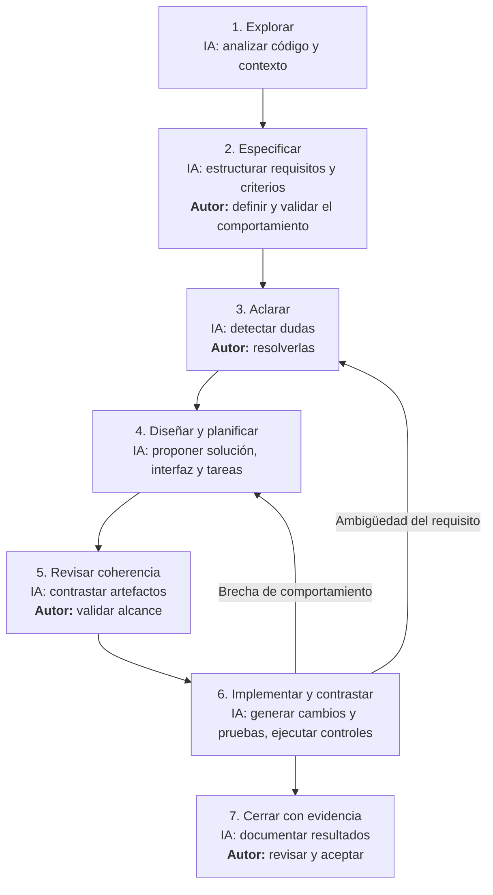

# PASP: ingeniería de software asistida por IA y SDD

**Del requisito al comportamiento verificable: contexto, decisiones, implementación y pruebas.**

PASP es una plataforma full stack de administración y seguimiento de prácticas
formativas. Integra cuatro perfiles, asignaciones entre tutores y becarios,
tareas, fichajes y evaluaciones. Su desarrollo combina React y TypeScript en el
frontend con una API Express, validación Zod y persistencia Prisma sobre SQL Server.

He utilizado **Cline y Codex** como apoyo al desarrollo y **Stitch** para el
diseño de las interfaces. La asistencia de IA ha servido para analizar el
repositorio, descomponer problemas, proponer soluciones, implementar cambios
y revisar sus resultados. Mi
responsabilidad como autor abarca las decisiones de producto y arquitectura,
la revisión del código, los límites de seguridad y la aceptación de las entregas.
El valor de este trabajo está en convertir una intención de producto en un cambio
que otra persona pueda comprender, comprobar y mantener.

Este documento conecta esa forma de trabajo con **Spec-Driven Development
(SDD)**: definir el comportamiento esperado y sus restricciones, traducirlos a
un plan y contrastar la implementación con criterios de aceptación explícitos.

> **Alcance de la evidencia.** El repositorio conserva reglas y memoria histórica
> del trabajo con Cline, instrucciones vigentes y código con pruebas. La
> [SPEC-022](../specs/spec-022.md) es una reconstrucción retrospectiva declarada.
> El ciclo SDD descrito es una propuesta metodológica adaptada a PASP; no
> constituye una cronología de ejecución ni acredita que todas las
> funcionalidades se especificaran formalmente antes de programarlas.

## Índice

- [1. Ciclo SDD aplicado a PASP](#1-ciclo-sdd-aplicado-a-pasp)
- [2. Contexto persistente y gobierno del agente](#2-contexto-persistente-y-gobierno-del-agente)
- [3. Diseño de interfaces con IA en Stitch](#3-diseño-de-interfaces-con-ia-en-stitch)
- [4. Verificación y definición de terminado](#4-verificación-y-definición-de-terminado)
- [5. Aprendizajes y evolución del método](#5-aprendizajes-y-evolución-del-método)
- [6. Referencias metodológicas](#6-referencias-metodológicas)

## 1. Ciclo SDD aplicado a PASP

El siguiente ciclo organiza el trabajo asistido por IA en PASP y sirve como
referencia para nuevas funcionalidades. El marcador **IA** identifica la
aportación del asistente en cada etapa: Cline y Codex como apoyo al desarrollo,
y Stitch para las propuestas visuales. El marcador **Autor** identifica las
decisiones y revisiones que mantengo bajo mi responsabilidad.



**1. Explorar antes de proponer.** Consultar `AGENTS.md`, la guía especializada
y el flujo afectado. Localizar componentes y servicios reutilizables. Separar
hechos observados, supuestos y preguntas pendientes.

> **IA — Análisis del repositorio:** Cline y Codex apoyan la lectura del código y
la documentación, localizan los archivos afectados y proponen puntos de
reutilización. Contrasto sus conclusiones con las fuentes vigentes para evitar
que una referencia histórica se convierta en una decisión actual.

**2. Especificar el resultado.** Describir actor, necesidad, alcance, exclusiones,
reglas de negocio y criterios «Dado / Cuando / Entonces». En PASP, una petición
como «el tutor consulta evaluaciones» necesita precisar de qué becarios, con qué
tipo de tutoría y qué ocurre si intenta consultar un identificador ajeno.

> **IA — Estructuración de requisitos:** el asistente ayuda a transformar la
necesidad en historias, restricciones y criterios comprobables, incluidos los
casos de acceso denegado.
>
> **Autor — Definición y validación del comportamiento:** defino la necesidad y
el alcance, y reviso que los requisitos y criterios describan el comportamiento
que realmente necesita el producto.

**3. Resolver las ambigüedades.** Aclarar decisiones que cambian permisos, datos
o experiencia. Una respuesta pendiente sobre quién puede modificar una
evaluación debe resolverse antes de convertirla en una regla del servicio.

> **IA — Detección de dudas:** el asistente señala información incompleta,
contradicciones y escenarios límite, y ayuda a incorporar las respuestas a la
especificación y al plan.
>
> **Autor — Resolución de ambigüedades:** resuelvo las preguntas de negocio y
permisos, y concreto las decisiones necesarias antes de implementar sus reglas.

**4. Diseñar y planificar.** Identificar contratos HTTP, validación Zod, servicios,
consultas Prisma, estados de interfaz y pruebas. Documentar alternativas y su
coste cuando exista una decisión relevante. Dividir el trabajo en incrementos
revisables que conecten API e interfaz cuando la funcionalidad lo requiera.

> **IA — Propuestas técnicas y visuales:** Cline y Codex ayudan a identificar las
capas afectadas, comparar alternativas y descomponer la implementación. Stitch
se ha utilizado para el diseño de interfaces, con referencias que orientan la
composición y la jerarquía visual. Selecciono y adapto las propuestas a la
arquitectura, los componentes y las restricciones de PASP.

**5. Revisar la coherencia antes de implementar.** Cada tarea debe responder a
un requisito; cada requisito debe tener una comprobación prevista. Si una tarea
introduce una librería o modifica un permiso sin necesidad funcional, revisar
el plan antes de ampliar el cambio.

> **IA — Revisión cruzada:** el asistente ayuda a contrastar requisitos, tareas,
código existente y pruebas previstas, señalando omisiones o cambios que exceden
el objetivo.
>
> **Autor — Validación del alcance:** reviso los hallazgos y decido los ajustes
necesarios antes de continuar con la implementación.

**6. Implementar y contrastar.** Escribir pruebas desde los criterios de aceptación,
incluidos escenarios negativos. Revisar el diff y ejecutar comprobaciones
proporcionales. Una prueba que refleja el mismo supuesto equivocado que el código
no demuestra que el requisito se cumpla.

> **IA — Implementación y apoyo a la verificación:** Cline y Codex se han utilizado
para implementar cambios acotados y revisar resultados. En este ciclo, el
asistente también ayuda a preparar pruebas, ejecutar los controles autorizados
y analizar fallos. Reviso el diff y las aserciones; la evidencia de verificación
procede de los resultados de las herramientas y de las comprobaciones del flujo.

**7. Cerrar con evidencia.** Registrar archivos afectados, verificaciones,
limitaciones y documentación actualizada. Si cambia el comportamiento acordado,
actualizar especificación, implementación y pruebas conjuntamente.

> **IA — Documentación y continuidad:** el asistente ayuda a resumir el cambio,
actualizar la documentación y dejar explícitas las comprobaciones ejecutadas y
las pendientes.
>
> **Autor — Revisión y aceptación:** compruebo la correspondencia entre el resumen
y los resultados antes de aceptar la entrega o autorizar su publicación.

Para un ajuste menor basta una descripción breve con su comprobación. Una
funcionalidad que atraviesa roles, API y datos justifica una especificación en
`specs/`. El detalle documental debe responder al riesgo y a la ambigüedad.

## 2. Contexto persistente y gobierno del agente

Una sesión de IA necesita conocer las restricciones del proyecto, los archivos
relevantes y qué significa terminar la tarea. PASP conserva esa información
fuera de la conversación para facilitar su revisión y reutilización.

### Cline y Codex en el desarrollo

Cline y Codex han formado parte del trabajo asistido sobre PASP. El repositorio
conserva el contexto histórico de Cline en su Memory Bank y organiza las
instrucciones vigentes en [AGENTS.md](../AGENTS.md), que sirve de referencia para
el trabajo con Codex. La documentación mantenida y las especificaciones permiten
retomar una tarea con las restricciones del proyecto explícitas.

La continuidad entre herramientas se apoya en esos artefactos versionados: el
objetivo, las decisiones y las comprobaciones deben poder recuperarse desde el
repositorio. Para cada intervención se seleccionan los archivos relevantes y se
contrasta su contenido con la implementación actual.

### Del Memory Bank a instrucciones vigentes

| Artefacto | Función en el proceso | Cómo interpretarlo hoy |
| --- | --- | --- |
| [`.clinerules/default-rules.md`](../.clinerules/default-rules.md) | Convenciones de implementación utilizadas con Cline. | Evidencia histórica; contiene estructuras y decisiones anteriores. |
| [`.clinerules/memory-bank-rules.md`](../.clinerules/memory-bank-rules.md) | Protocolo de lectura y actualización de memoria entre sesiones. | Explica el mecanismo de continuidad original. |
| [`.cline/memory/activeContext.md`](../.cline/memory/activeContext.md) | Última tarea registrada, archivos afectados y decisiones. | Fotografía de una etapa, no estado actual del producto. |
| [`.cline/memory/progress.md`](../.cline/memory/progress.md) | Seguimiento por módulos e historias de usuario. | Sus porcentajes no son métricas actuales. |
| [`.cline/memory/systemPatterns.md`](../.cline/memory/systemPatterns.md) y [`techContext.md`](../.cline/memory/techContext.md) | Patrones y contexto técnico conservados. | Deben contrastarse con el código y la configuración efectiva. |
| [`AGENTS.md`](../AGENTS.md) | Instrucciones actuales para trabajar en el repositorio. | Define alcance, convenciones, permisos y comprobaciones. |
| [`docs/`](./) y [`specs/`](../specs/) | Conocimiento mantenido y comportamiento esperado. | Conectan producto, decisiones técnicas y aceptación. |

Esta separación evita que una instrucción antigua reactive decisiones ya
descartadas. Por ejemplo, la memoria técnica conserva referencias a pruebas
planificadas con Jest, mientras que la configuración actual del backend utiliza
Vitest. Recuperar contexto exige comprobar su vigencia.

### Límites concretos de autonomía

Las reglas actuales exigen inspeccionar el estado de Git, preservar cambios
preexistentes y limitar cada intervención a la petición. También reservan la
autorización explícita para commits, pushes, despliegues, migraciones remotas y
semillas sobre bases compartidas; las nuevas dependencias de producción requieren
justificación y aprobación.

La IA puede ayudar a explorar alternativas y ejecutar tareas acotadas. La
decisión sobre alcance, exposición de datos y publicación sigue siendo humana.
Estas instrucciones gobiernan el proceso; la seguridad del producto se aplica
mediante validaciones, autenticación y autorización en el backend.

## 3. Diseño de interfaces con IA en Stitch

He utilizado **Stitch para el diseño de las interfaces de PASP**. Las referencias
visuales generadas sirvieron como guía de composición, jerarquía y espaciado. La
implementación final se adaptó al proyecto con React, TypeScript y CSS Modules,
manteniendo la lógica y los permisos de la aplicación, como se recoge en la
[guía de UI/UX](UI_UX.md).

### Conectar el diseño con los requisitos

En el ciclo SDD, las propuestas visuales ayudan a concretar cómo se presenta una
funcionalidad. En PASP, eso implica relacionar cada pantalla con las necesidades
del administrador, del tutor de empresa, del tutor académico o del becario:
qué información necesita consultar, qué acciones tiene disponibles y qué
respuesta debe recibir al interactuar.

El criterio de diseño es facilitar las tareas de administración y seguimiento
con una apariencia sobria y coherente. La jerarquía de títulos, tarjetas, tablas
y formularios debe ayudar a localizar información y comprender las acciones.
La elección y adaptación de las propuestas visuales forma parte de mi
responsabilidad como autor.

### De la referencia visual a la interfaz funcional

La integración de un diseño en PASP requiere resolver aspectos que deben quedar
explícitos en sus criterios de aceptación:

- Reutilización de componentes, tokens y CSS Modules para conservar la identidad
  visual entre pantallas.
- Conexión con los servicios de la API y representación de datos reales del flujo.
- Estados de carga, error, vacío y confirmación de las operaciones.
- Adaptación a escritorio y móvil, navegación por teclado y foco visible.
- Coherencia entre las acciones presentadas y los permisos aplicados en servidor.

Stitch aporta apoyo al diseño; Cline y Codex forman parte de la asistencia al
desarrollo. La revisión del resultado debe comprobar que la interfaz implementada
responde al requisito y conserva la coherencia del producto. Una propuesta visual
sirve para orientar esa implementación; las pruebas y la revisión renderizada
permiten evaluar su comportamiento final.

## 4. Verificación y definición de terminado

La respuesta del agente es una propuesta que debe contrastarse con evidencia.
PASP dispone de Vitest y Supertest en backend, Vitest y Testing Library en
frontend, y Playwright para recorridos completos.

Según el ámbito del cambio, las comprobaciones se ejecutan desde `backend/`,
`frontend/` o ambos:

```bash
npm run lint
npm run format:check
npm test
npm run build
```

Para cambios que atraviesan frontend, API o datos, `npm run test:e2e` se ejecuta
desde `frontend/` únicamente con el entorno exclusivo y la autorización
descritos en [TESTING.md](TESTING.md). Las comprobaciones visuales complementan
las pruebas automatizadas cuando cambia una interacción.

Los workflows existentes ejecutan lint, pruebas y compilación antes de sus
despliegues. Su configuración no demuestra que una ejecución concreta haya
pasado, ni implica que ejecuten E2E o todas las comprobaciones locales.

La definición de terminado propuesta exige:

- Criterios de aceptación comprobados, incluidos errores y accesos denegados.
- Diff revisado y sin cambios ajenos al alcance.
- Validaciones y permisos conservados en el servidor.
- Pruebas relevantes y compilación verificadas, con resultados registrados.
- Especificación y documentación coherentes con el comportamiento entregado.
- Pendientes explícitos: una prueba no ejecutada se registra como tal.

Para dar seguimiento, cada entrega puede registrar requisito, cambio, prueba,
resultado y limitación. No se atribuyen porcentajes de ahorro, cobertura total
ni mejoras de productividad sin una medición reproducible.

## 5. Aprendizajes y evolución del método

**La memoria necesita mantenimiento y jerarquía.** Los registros de Cline
permiten comprender etapas previas, pero sus referencias obsoletas muestran por
qué la continuidad del agente depende de fuentes vigentes y verificables.

**Las restricciones tienen que llegar al código.** Escribir que un tutor solo
accede a sus becarios o que una demo es de consulta resulta útil para guiar al
agente; su cumplimiento depende de los controles de la API y sus pruebas.

**La trazabilidad mejora la revisión.** La especificación de la demo permite
discutir un requisito concreto y localizar dónde se implementa, sin reconstruir
todo el contexto de una conversación.

**La evidencia tiene límites.** El repositorio público parte de una copia limpia
y no contiene el historial original completo. La especificación retrospectiva,
la memoria histórica y las pruebas muestran aspectos distintos del trabajo;
ninguno acredita por sí solo una adopción íntegra de SDD desde el inicio.

Como evolución propuesta, las siguientes funcionalidades amplias deberían
incorporar especificaciones previas, identificadores de requisito relacionados
con pruebas y un registro breve de alternativas cuando una decisión afecte a
seguridad, datos o mantenimiento. También sería útil medir defectos detectados
antes de publicar y trabajo rehecho por requisitos ambiguos, sin confundir
cantidad de código generado con valor entregado.

Mi responsabilidad profesional es poder explicar por qué existe cada cambio,
qué restricciones respeta, cómo se ha comprobado y qué incertidumbre permanece.
La IA amplía la capacidad de ejecución; ese criterio de ingeniería dirige su uso.
