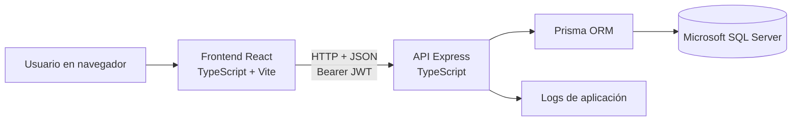
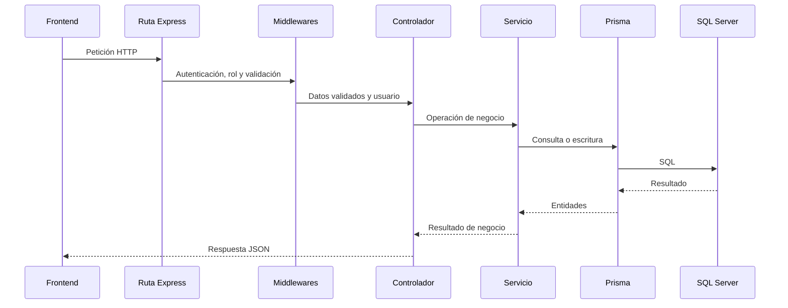

# Arquitectura de PASP

Este documento describe la arquitectura implementada actualmente en PASP. Su
objetivo es facilitar la comprensión y la continuación del proyecto.

## Visión general (Stack)

PASP es una aplicación web cliente-servidor compuesta por:

- Una aplicación de página única (SPA) desarrollada con React.
- Una API HTTP desarrollada con Express.
- Una base de datos Microsoft SQL Server.
- Prisma como capa de acceso a datos y sistema de migraciones.



El frontend y el backend son proyectos Node.js independientes. Cada uno
mantiene su propio `package.json`, `package-lock.json`, configuración de
TypeScript, herramientas de calidad y conjunto de pruebas.

## Responsabilidades de los componentes

| Componente | Responsabilidad |
| --- | --- |
| Frontend | Interfaz, navegación, estado de autenticación, validaciones de experiencia de usuario y consumo de la API. |
| Backend | Autenticación, autorización, validación definitiva, reglas de negocio, acceso a datos, gestión de errores y logs. |
| Prisma | Mapeo entre objetos y SQL Server, relaciones y ejecución de migraciones. |
| SQL Server | Persistencia de usuarios, becarios, tutorías, tareas, fichajes y evaluaciones. |

Las validaciones del frontend ayudan al usuario, pero no constituyen una
frontera de seguridad. El backend debe validar y autorizar cada operación.

## Frontend

### Composición

El punto de entrada es `frontend/src/main.tsx`. La jerarquía principal es:

```text
main.tsx
└── AppProviders
    ├── HashRouter
    └── AuthProvider
        └── App
            └── AppRouter
```

Se utiliza `HashRouter`, por lo que la ruta de la aplicación se mantiene en el
fragmento de la URL. Esta decisión evita que el servidor que entrega los
archivos estáticos tenga que resolver directamente cada ruta del frontend.

`AuthProvider` mantiene el usuario autenticado, restaura la sesión al cargar la
aplicación y coordina la respuesta ante un token caducado. No existe actualmente
otra solución global de gestión de estado.

### Organización

```text
frontend/src/
├── app/          # Proveedores y enrutamiento principal
├── features/     # Funcionalidades agrupadas por dominio
│   ├── admin/
│   ├── auth/
│   ├── becarios/
│   ├── fichajes/
│   └── tutores/
├── shared/       # API, componentes, constantes y estilos reutilizables
├── types/        # Tipos de datos compartidos
└── test/         # Configuración común de pruebas
```

Dentro de cada funcionalidad se separan, cuando resulta necesario, páginas,
componentes, servicios, validaciones, mapeadores y estilos. Los componentes
compartidos de interfaz se encuentran en `shared/components/ui`.

Los estilos combinan variables globales en `shared/styles/tokens.css` con
módulos CSS asociados a componentes o páginas.

### Navegación y permisos

`frontend/src/app/router.tsx` define rutas específicas para:

- Administrador.
- Tutor de empresa.
- Tutor académico.
- Becario.

`ProtectedRoute` impide desde la interfaz el acceso a rutas no permitidas para
el rol autenticado. Esta protección mejora la navegación, pero siempre se
complementa con los middlewares de autorización del backend.

### Acceso a la API

`frontend/src/shared/api/api.ts` centraliza:

- La URL base, configurada mediante `VITE_API_URL`.
- El envío de peticiones JSON.
- La cabecera `Authorization: Bearer <token>`.
- La normalización de errores HTTP.
- La detección local de tokens caducados.
- La reacción global ante respuestas `401`.

El token y los datos básicos del usuario se almacenan en `sessionStorage`. La
sesión sobrevive a una recarga, queda aislada en la pestaña actual y se elimina
al cerrarla. Los servicios dentro de cada funcionalidad encapsulan las
operaciones concretas que consumen las páginas y componentes.

## Backend

### Entrada y canalización HTTP

`backend/src/server.ts` inicia el servidor. `backend/src/app.ts` configura
Express y registra, en este orden general:

1. Identificador de petición.
2. Cabeceras de seguridad mediante Helmet.
3. Política CORS.
4. Lectura de cuerpos JSON.
5. Límite global de peticiones para `/api`.
6. Endpoints de salud.
7. Rutas de negocio.
8. Respuesta para rutas inexistentes.
9. Manejador centralizado de errores.

El flujo habitual de una operación es:



No todas las rutas contienen exactamente todas las capas: algunas operaciones
simples acceden a servicios ya existentes y los módulos más recientes agrupan
sus piezas de otra forma.

### Organización

```text
backend/src/
├── config/       # Entorno, CORS y logger
├── controllers/  # Adaptación entre HTTP y servicios
├── database/     # Instancia de Prisma
├── middlewares/  # Autenticación, roles, errores y rate limiting
├── modules/      # Funcionalidades modularizadas recientemente
├── routes/       # Definición y composición de endpoints
├── services/     # Reglas de negocio y acceso a datos
├── shared/       # Errores, respuestas, validación y utilidades comunes
├── seeds/        # Preparación de datos administrativos, demo y E2E
├── app.ts        # Configuración de Express
└── server.ts     # Inicio del proceso HTTP
```

En el backend conviven dos estilos:

- Controladores y servicios organizados en carpetas globales.
- Módulos por funcionalidad para tareas, tutores, usuarios y becarios.

Esta convivencia es resultado de una refactorización progresiva. Al ampliar el
sistema debe evitarse crear una tercera variante y decidirse si el código nuevo
continúa la modularización existente.

### API y compatibilidad

La ruta canónica es `/api/v1`. Bajo ella se agrupan:

```text
/api/v1/auth
/api/v1/tutor
/api/v1/tutor-academico
/api/v1/becario
/api/v1/fichaje
/api/v1/admin
/api/v1/usuarios
```

`app.ts` monta también las mismas áreas directamente bajo `/api/*`. Son rutas
heredadas mantenidas temporalmente para no romper clientes anteriores. El
frontend nuevo debe consumir `/api/v1`; las rutas heredadas deberían retirarse
solo después de comprobar que ningún consumidor depende de ellas.

Las respuestas nuevas siguen estas formas generales:

```json
{
  "success": true,
  "message": "Mensaje opcional",
  "data": {}
}
```

```json
{
  "success": false,
  "code": "CODIGO_DE_ERROR",
  "message": "Descripción",
  "details": {}
}
```

El campo `details` es opcional. En desarrollo, algunos errores pueden incluir
la traza; en otros entornos no debe exponerse.

## Autenticación y autorización

El inicio de sesión comprueba las credenciales almacenadas mediante bcrypt y
emite un JWT firmado con `JWT_SECRET`. Las sesiones privadas utilizan
`JWT_EXPIRES_IN`, con un valor predeterminado de dos horas. Los accesos públicos
se identifican con la propiedad `demo` del token y utilizan
`DEMO_JWT_EXPIRES_IN`, cuyo valor predeterminado es de treinta minutos.

El flujo es:

1. El usuario envía sus credenciales al endpoint de acceso.
2. El backend comprueba el usuario y la contraseña.
3. El backend devuelve un JWT y los datos necesarios del usuario.
4. El frontend conserva ambos valores en `sessionStorage`.
5. Las peticiones protegidas envían el JWT como token Bearer.
6. `authenticateToken` verifica firma y validez y añade el usuario a la
   petición.
7. El middleware de rol autoriza o rechaza la operación.

Cuando `PASP_DEMO_MODE=true`, los cuatro accesos públicos se resuelven en el
servidor a partir del rol solicitado, sin entregar credenciales al navegador.
Las peticiones de escritura de una sesión demo se rechazan en el middleware de
autenticación antes de alcanzar el controlador. La cuenta superadministradora,
que accede con credenciales privadas, queda exceptuada de ese bloqueo.

Los roles reconocidos son:

- `Administrador`
- `Tutor_Empresa`
- `Tutor_Academico`
- `Becario`

El modelo `Usuario` incluye `primerAcceso`, usado para obligar a cambiar la
contraseña inicial. El login tiene un límite de diez intentos por dirección IP
en una ventana de quince minutos, salvo durante las pruebas.

Actualmente no hay renovación de tokens, recuperación de contraseña ni
revocación de sesión en el servidor. El cierre de sesión elimina los datos
locales del navegador.

## Persistencia

`backend/prisma/schema.prisma` es la fuente técnica del modelo de datos. Prisma
se conecta a SQL Server mediante `DATABASE_URL`.

Las entidades principales son:

| Modelo | Finalidad |
| --- | --- |
| `Usuario` | Identidad, credenciales, rol, estado y datos corporativos comunes. |
| `Becario` | Información personal y académica específica de la práctica. |
| `TutorBecario` | Asignación entre un tutor y un becario, incluido el tipo de tutoría. |
| `Tarea` | Trabajo asignado por un tutor a un becario. |
| `TareaHistorial` | Trazabilidad de los cambios de estado de una tarea. |
| `Fichaje` | Entrada, salida y horas registradas por día. |
| `Evaluacion` | Puntuaciones y comentarios realizados por un tutor. |

Las modificaciones de esquema se conservan como migraciones versionadas en
`backend/prisma/migrations`. Los detalles de relaciones, restricciones y
operación de la base de datos se documentan en `docs/DATABASE.md`.

## Aspectos transversales

### Configuración

El backend valida al arrancar las variables obligatorias `DATABASE_URL` y
`JWT_SECRET`. El puerto, el origen del frontend y la duración del token se
configuran también mediante el entorno. La plantilla local se encuentra en
`backend/.env.example`.

### Validación

Los esquemas Zod de `backend/src/shared/validation` validan datos de usuarios,
becarios, tareas, evaluaciones y operaciones de tutoría. Las reglas que afectan
a seguridad o integridad deben permanecer en el backend aunque exista una
validación equivalente en el frontend.

### Errores y trazabilidad

Cada petición recibe o reutiliza un identificador `x-request-id`. El manejador
de errores produce una respuesta uniforme y registra el identificador junto con
el método y la ruta para facilitar el diagnóstico.

En desarrollo, Winston escribe logs rotatorios y también muestra información en
consola. Los archivos tienen una retención configurada de 30 días. En producción
el logger escribe en la salida estándar. Los logs de autenticación incluyen
datos como correo e IP, por lo que su acceso y conservación deben revisarse
antes de utilizar datos reales.

### Disponibilidad de la base de datos

La API expone:

- `/api/v1/health`, que comprueba que el proceso HTTP responde.
- `/api/v1/health/ready`, que comprueba la disponibilidad de la base de datos.

El backend identifica ciertos fallos transitorios de SQL Server y dispone de
reintentos. Durante el inicio de sesión puede responder con
`DATABASE_WAKING_UP`; el frontend reconoce ese estado, consulta la disponibilidad
y vuelve a intentar el acceso durante un tiempo limitado.

## Decisiones y limitaciones relevantes

- **SPA con `HashRouter`:** simplifica el alojamiento estático, pero genera URL
  con fragmento.
- **JWT sin estado:** evita sesiones en el servidor, pero actualmente no ofrece
  revocación ni renovación.
- **Token en `sessionStorage`:** mantiene la sesión durante las recargas y la
  limita a una pestaña. Como cualquier almacenamiento accesible desde
  JavaScript, requiere conservar las defensas frente a XSS.
- **Demo pública de solo lectura:** el servidor marca los tokens demo y bloquea
  sus escrituras. El modo demo también protege las cuentas ordinarias de la base
  publicada, mientras conserva el acceso privado del superadministrador.
- **Prisma con SQL Server:** centraliza el modelo y las migraciones; los cambios
  manuales en la base de datos deben evitarse o reflejarse inmediatamente en
  Prisma.
- **API versionada con compatibilidad heredada:** facilita la transición, pero
  duplica temporalmente las rutas expuestas.
- **Dos estilos internos en el backend:** la modularización está incompleta y
  requiere mantener criterios coherentes en futuras ampliaciones.
- **Dependencia de constantes de dominio escritas como texto:** roles, tipos y
  estados deben modificarse de forma coordinada en backend, frontend y datos
  existentes.

Los mecanismos de seguridad presentes en la aplicación se documentan en
`docs/SECURITY.md`.
