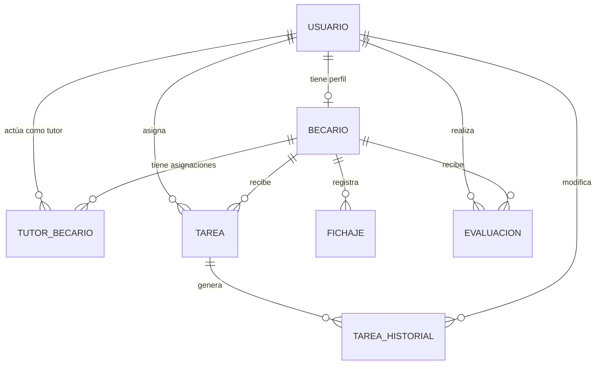

# Base de datos de PASP

Este documento describe el modelo de datos actual de PASP, sus relaciones y el
procedimiento previsto para modificarlo de forma segura.

La fuente técnica principal es `backend/prisma/schema.prisma`. Las migraciones
versionadas de `backend/prisma/migrations` representan la evolución aplicada a
SQL Server.


## Tecnología y configuración

PASP utiliza:

- Microsoft SQL Server como sistema gestor de base de datos.
- Prisma 6 como ORM y herramienta de migraciones.
- `@prisma/client` para las consultas desde el backend.

La conexión se define mediante `DATABASE_URL`. La plantilla local está en
`backend/.env.example`.

```dotenv
DATABASE_URL="sqlserver://SERVIDOR:1433;database=PASP;user=USUARIO;password=CONTRASENA;encrypt=true;trustServerCertificate=true"
```

Los valores son únicamente ilustrativos. Las credenciales reales deben
permanecer fuera del repositorio y ser distintas para cada entorno. En un
entorno compartido debe revisarse si corresponde mantener
`trustServerCertificate=true`.

## Diagrama de relaciones



`Usuario` representa todas las identidades del sistema. Solo los usuarios con
rol de becario deben tener un registro asociado en `Becario`. Los tutores no
tienen una tabla de perfil independiente: las asignaciones se representan
mediante `TutorBecario`.

## Modelos

Las tablas siguientes recogen todos los campos escalares definidos en el
esquema Prisma actual. La columna **Obligatorio** indica si SQL Server admite
`NULL`; los valores generados automáticamente se especifican en la descripción.
Los campos de relación de Prisma, como `usuario`, `tareas` o `evaluaciones`, no
son columnas adicionales: representan asociaciones construidas a partir de las
claves foráneas indicadas.

### Usuario

Tabla SQL: `Usuarios`.

Contiene la identidad, las credenciales y los datos corporativos comunes:

| Campo Prisma | Columna SQL | Tipo SQL | Obligatorio | Descripción |
| --- | --- | --- | --- | --- |
| `idUsuario` | `id_usuario` | `INT` | Sí | Clave primaria autoincremental. |
| `email` | `email` | `VARCHAR(255)` | Sí | Identificador de acceso; tiene restricción única. |
| `passwordHash` | `password_hash` | `VARCHAR(255)` | Sí | Hash de la contraseña; nunca contiene la contraseña original. |
| `rol` | `rol` | `VARCHAR(50)` | Sí | Rol funcional almacenado como texto. |
| `nombre` | `nombre` | `VARCHAR(100)` | Sí | Nombre mostrado en la aplicación. |
| `apellidos` | `apellidos` | `VARCHAR(150)` | Sí | Apellidos mostrados en la aplicación. |
| `practica` | `practica` | `VARCHAR(100)` | No | Práctica o área corporativa asociada. |
| `cliente` | `cliente` | `VARCHAR(100)` | No | Cliente corporativo asociado. |
| `primerAcceso` | `primer_acceso` | `BIT` | Sí | Indica que el cambio de contraseña es obligatorio; por defecto `true`. |
| `esSuperAdmin` | `es_super_admin` | `BIT` | Sí | Identifica y protege al superadministrador; por defecto `false`. |
| `activo` | `activo` | `BIT` | Sí | Permite desactivar la cuenta sin eliminarla; por defecto `true`. |
| `createdAt` | `created_at` | `DATETIME2` | Sí | Fecha de creación generada automáticamente. |
| `updatedAt` | `updated_at` | `DATETIME2` | Sí | Fecha de última actualización gestionada automáticamente por Prisma. |

Valores de rol reconocidos por la aplicación:

```text
Administrador
Tutor_Empresa
Tutor_Academico
Becario
```

El rol es un `VARCHAR`, no un enum ni una restricción `CHECK` de SQL Server. La
validez depende de las constantes y validaciones de la aplicación.

Índices relevantes:

- Índice único de `email`, además de un índice explícito para búsquedas.
- Índice compuesto por `rol` y `activo`.
- Índices para `cliente` y `practica`.

### Becario

Tabla SQL: `Becarios`.

Extiende a `Usuario` con los datos propios de las prácticas:

| Campo Prisma | Columna SQL | Tipo SQL | Obligatorio | Descripción |
| --- | --- | --- | --- | --- |
| `idBecario` | `id_becario` | `INT` | Sí | Clave primaria autoincremental. |
| `idUsuario` | `id_usuario` | `INT` | Sí | Clave foránea única hacia `Usuarios.id_usuario`; establece la relación uno a uno. |
| `telefonoPersonal` | `telefono_personal` | `VARCHAR(20)` | No | Teléfono personal del becario. |
| `emailPersonal` | `email_personal` | `VARCHAR(255)` | No | Correo personal, distinto del correo corporativo de acceso. |
| `linkedin` | `linkedin` | `VARCHAR(255)` | No | URL o identificador del perfil de LinkedIn. |
| `tipoFormacion` | `tipo_formacion` | `VARCHAR(50)` | No | Tipo de formación cursada. |
| `nombreGradoUniversitario` | `nombre_grado_universitario` | `VARCHAR(200)` | No | Denominación del grado universitario cuando corresponda. |
| `nombreFormacionProfesional` | `nombre_formacion_profesional` | `VARCHAR(200)` | No | Denominación de la formación profesional cuando corresponda. |
| `centroEstudios` | `centro_estudios` | `VARCHAR(200)` | No | Centro educativo del becario. |
| `fechaInicioPracticas` | `fecha_inicio_practicas` | `DATE` | Sí | Fecha de inicio del periodo de prácticas. |
| `fechaFinPracticas` | `fecha_fin_practicas` | `DATE` | No | Fecha prevista o efectiva de finalización. |
| `horasContrato` | `horas_contrato` | `DECIMAL(7,2)` | Sí | Número de horas establecido para el contrato o convenio. |
| `ayudaEconomica` | `ayuda_economica` | `INT` | No | Ayuda económica; el esquema actual no especifica moneda ni admite decimales. |
| `equipoEnUso` | `equipo_en_uso` | `VARCHAR(100)` | No | Equipo corporativo asignado o utilizado. |
| `createdAt` | `created_at` | `DATETIME2` | Sí | Fecha de creación generada automáticamente. |
| `updatedAt` | `updated_at` | `DATETIME2` | Sí | Fecha de última actualización gestionada automáticamente por Prisma. |

`idUsuario` es único, por lo que un usuario solo puede tener un perfil de
becario. `fechaInicioPracticas` y `horasContrato` son obligatorios;
`fechaFinPracticas` es opcional.

`tipoFormacion` se almacena como texto. Los valores actuales son
`Universitaria` y `Formacion_Profesional`, aunque el código conserva
compatibilidad con los valores heredados `GRADO` y `FP`.

### TutorBecario

Tabla SQL: `Tutor_Becario`.

Representa la relación entre un usuario tutor y un becario:

| Campo Prisma | Columna SQL | Tipo SQL | Obligatorio | Descripción |
| --- | --- | --- | --- | --- |
| `id` | `id` | `INT` | Sí | Clave primaria autoincremental de la asignación. |
| `idTutor` | `id_tutor` | `INT` | Sí | Clave foránea hacia `Usuarios.id_usuario`; usuario que actúa como tutor. |
| `idBecario` | `id_becario` | `INT` | Sí | Clave foránea hacia `Becarios.id_becario`; becario asignado. |
| `tipoTutor` | `tipo_tutor` | `VARCHAR(50)` | Sí | Tipo funcional de tutoría almacenado como texto. |
| `fechaAsignacion` | `fecha_asignacion` | `DATE` | Sí | Fecha de asignación; se genera con la fecha actual. |
| `activo` | `activo` | `BIT` | Sí | Indica si la asignación está vigente; por defecto `true`. |
| `createdAt` | `created_at` | `DATETIME2` | Sí | Fecha de creación generada automáticamente. |

Tipos reconocidos:

```text
Empresa_Principal
Empresa_Secundario
Academico
```

La restricción única `(idBecario, tipoTutor, activo)` impide duplicar para un
becario una combinación del mismo tipo y estado. Como consecuencia, el diseño
permite como máximo una asignación activa y una inactiva de cada tipo para cada
becario. Si se quisiera conservar un historial con varias asignaciones
inactivas del mismo tipo, esta restricción tendría que rediseñarse.

### Tarea

Tabla SQL: `Tareas`.

Registra una tarea asignada por un tutor a un becario:

| Campo Prisma | Columna SQL | Tipo SQL | Obligatorio | Descripción |
| --- | --- | --- | --- | --- |
| `idTarea` | `id_tarea` | `INT` | Sí | Clave primaria autoincremental. |
| `idBecario` | `id_becario` | `INT` | Sí | Clave foránea hacia `Becarios.id_becario`; destinatario de la tarea. |
| `idTutorAsignador` | `id_tutor_asignador` | `INT` | Sí | Clave foránea hacia `Usuarios.id_usuario`; tutor que asignó la tarea. |
| `nombreTarea` | `nombre_tarea` | `VARCHAR(200)` | Sí | Nombre breve de la tarea. |
| `descripcion` | `descripcion` | `TEXT` | No | Descripción detallada de la tarea. |
| `estado` | `estado` | `VARCHAR(50)` | Sí | Estado funcional de la tarea almacenado como texto. |
| `fechaInicio` | `fecha_inicio` | `DATE` | Sí | Fecha de inicio de la tarea. |
| `fechaFinEstimada` | `fecha_fin_estimada` | `DATE` | No | Fecha prevista de finalización. |
| `fechaCompletada` | `fecha_completada` | `DATE` | No | Fecha en la que la tarea quedó completada. |
| `createdAt` | `created_at` | `DATETIME2` | Sí | Fecha de creación generada automáticamente. |
| `updatedAt` | `updated_at` | `DATETIME2` | Sí | Fecha de última actualización gestionada automáticamente por Prisma. |

Estados reconocidos:

```text
Pendiente
En_Progreso
Completada
```

Los índices principales cubren las consultas por becario y estado, por tutor y
por estado. Los estados también son texto sin restricción `CHECK` en la base de
datos.

### TareaHistorial

Tabla SQL: `Tarea_Historial`.

Conserva cada cambio de estado de una tarea:

| Campo Prisma | Columna SQL | Tipo SQL | Obligatorio | Descripción |
| --- | --- | --- | --- | --- |
| `idHistorial` | `id_historial` | `INT` | Sí | Clave primaria autoincremental del registro histórico. |
| `idTarea` | `id_tarea` | `INT` | Sí | Clave foránea hacia `Tareas.id_tarea`. |
| `estadoAnterior` | `estado_anterior` | `VARCHAR(50)` | No | Estado previo; puede ser nulo en el primer registro. |
| `estadoNuevo` | `estado_nuevo` | `VARCHAR(50)` | Sí | Estado resultante del cambio. |
| `idUsuarioModificador` | `id_usuario_modificador` | `INT` | Sí | Clave foránea hacia `Usuarios.id_usuario`; identifica a quien realizó el cambio. |
| `fechaCambio` | `fecha_cambio` | `DATETIME2` | Sí | Momento del cambio, generado automáticamente. |
| `createdAt` | `created_at` | `DATETIME2` | Sí | Fecha de creación del registro, generada automáticamente. |

La eliminación de una tarea elimina su historial en cascada. La eliminación del
usuario que figura como modificador está restringida mientras existan registros
que lo referencien.

### Fichaje

Tabla SQL: `Fichajes`.

Registra la jornada diaria de un becario:

| Campo Prisma | Columna SQL | Tipo SQL | Obligatorio | Descripción |
| --- | --- | --- | --- | --- |
| `idFichaje` | `id_fichaje` | `INT` | Sí | Clave primaria autoincremental. |
| `idBecario` | `id_becario` | `INT` | Sí | Clave foránea hacia `Becarios.id_becario`. |
| `fecha` | `fecha` | `DATE` | Sí | Día del fichaje. |
| `horaEntrada` | `hora_entrada` | `DATETIME2` | Sí | Momento de inicio de la jornada. |
| `horaSalida` | `hora_salida` | `DATETIME2` | No | Momento de finalización de la jornada. |
| `horasTrabajadas` | `horas_trabajadas` | `DECIMAL(5,2)` | No | Total de horas calculado o registrado. |
| `horas_imputadas` | `horas_imputadas` | `DECIMAL(5,2)` | No | Horas imputadas; conserva un nombre Prisma no normalizado. |
| `justificacion` | `justificacion` | `TEXT` | No | Observación o justificación opcional. |
| `createdAt` | `created_at` | `DATETIME2` | Sí | Fecha de creación generada automáticamente. |
| `updatedAt` | `updated_at` | `DATETIME2` | Sí | Fecha de última actualización gestionada automáticamente por Prisma. |

La combinación `(idBecario, fecha)` es única: un becario solo puede tener un
fichaje por día.

La migración `20260423100928_simplificar_fichajes_v2_1` eliminó el estado, el
validador y la fecha de validación del modelo anterior. Esa migración descarta
los datos de dichas columnas y no debe aplicarse sin revisar previamente una
base que aún conserve información antigua.

### Evaluacion

Tabla SQL: `Evaluaciones`.

Registra una evaluación realizada por un tutor:

| Campo Prisma | Columna SQL | Tipo SQL | Obligatorio | Descripción |
| --- | --- | --- | --- | --- |
| `idEvaluacion` | `id_evaluacion` | `INT` | Sí | Clave primaria autoincremental. |
| `idBecario` | `id_becario` | `INT` | Sí | Clave foránea hacia `Becarios.id_becario`; becario evaluado. |
| `idTutorEvaluador` | `id_tutor_evaluador` | `INT` | Sí | Clave foránea hacia `Usuarios.id_usuario`; tutor que realiza la evaluación. |
| `titulo` | `titulo` | `VARCHAR(200)` | Sí | Título identificativo de la evaluación. |
| `fechaEvaluacion` | `fecha_evaluacion` | `DATE` | Sí | Fecha de evaluación; por defecto se genera con la fecha actual. |
| `puntuacionPuntualidad` | `puntuacion_puntualidad` | `TINYINT` | Sí | Puntuación de puntualidad. |
| `puntuacionCalidad` | `puntuacion_calidad` | `TINYINT` | Sí | Puntuación de calidad del trabajo. |
| `puntuacionActitud` | `puntuacion_actitud` | `TINYINT` | Sí | Puntuación de actitud. |
| `puntuacionAutonomia` | `puntuacion_autonomia` | `TINYINT` | Sí | Puntuación de autonomía. |
| `puntuacionComunicacion` | `puntuacion_comunicacion` | `TINYINT` | Sí | Puntuación de comunicación. |
| `puntuacionMedia` | `puntuacion_media` | `FLOAT(53)` | No | Media calculada o almacenada de las puntuaciones. |
| `comentarios` | `comentarios` | `TEXT` | No | Observaciones cualitativas del tutor. |
| `createdAt` | `created_at` | `DATETIME2` | Sí | Fecha de creación generada automáticamente. |

Las puntuaciones individuales se almacenan como `TINYINT`. El esquema no define
restricciones `CHECK` para su rango; las reglas se validan en la aplicación.

## Relaciones y comportamiento al borrar

Las acciones observadas en las migraciones actuales son:

| Relación | Al eliminar el registro padre |
| --- | --- |
| `Usuario` → perfil `Becario` | El perfil se elimina en cascada. |
| `Becario` → `TutorBecario` | Las asignaciones se eliminan en cascada. |
| `Becario` → `Tarea` | Las tareas se eliminan en cascada. |
| `Tarea` → `TareaHistorial` | El historial se elimina en cascada. |
| `Becario` → `Evaluacion` | Las evaluaciones se eliminan en cascada. |
| `Becario` → `Fichaje` | La eliminación está restringida (`NO ACTION`). |
| `Usuario` tutor → asignaciones, tareas y evaluaciones | La eliminación está restringida. |
| `Usuario` modificador → historial de tareas | La eliminación está restringida. |

Estas reglas implican que eliminar un usuario puede fallar si participa como
tutor, evaluador o modificador, o si su perfil de becario conserva fichajes. El
servicio actual llama a `prisma.usuario.delete` sin limpiar todas esas
relaciones.

Para datos reales debe priorizarse `activo=false` frente al borrado físico,
salvo que se haya definido una política de conservación y se hayan revisado
todas las dependencias.

## Restricciones e índices importantes

| Tabla | Restricción o índice | Finalidad |
| --- | --- | --- |
| `Usuarios` | `email` único | Evitar identidades duplicadas. |
| `Becarios` | `id_usuario` único | Relación uno a uno con `Usuario`. |
| `Tutor_Becario` | `(id_becario, tipo_tutor, activo)` único | Evitar asignaciones duplicadas por tipo y estado. |
| `Fichajes` | `(id_becario, fecha)` único | Un fichaje diario por becario. |
| `Tareas` | `(id_becario, estado)` | Acelerar listados de tareas del becario. |
| `Tarea_Historial` | `(id_tarea, fecha_cambio)` | Recuperar cronológicamente el historial. |
| `Evaluaciones` | Índices por becario, fecha y tutor | Acelerar consultas de seguimiento. |

Antes de añadir índices debe comprobarse el patrón real de consultas. Cada
índice mejora determinadas lecturas, pero añade coste a escrituras y espacio de
almacenamiento.

## Migraciones

### Aplicar migraciones existentes

Desde `backend/`:

```bash
npm ci
npm run migrate:deploy
```

`migrate:deploy` aplica únicamente las migraciones pendientes. Antes de
ejecutarlo debe verificarse que `DATABASE_URL` apunta a la base correcta.

Para consultar el estado de una base configurada mediante `.env.azure` existe:

```bash
npm run migrate:azure:status
```

### Crear una migración

Flujo recomendado para modificar el esquema:

1. Crear una base local desechable y aplicar todas las migraciones existentes.
2. Modificar `backend/prisma/schema.prisma`.
3. Generar la migración sin aplicarla:

   ```bash
   npm run migrate:create -- --name descripcion_del_cambio
   ```

4. Revisar manualmente el SQL generado, especialmente operaciones `DROP`,
   cambios de tipo, columnas obligatorias y acciones en cascada.
5. Aplicar y probar la migración en la base local.
6. Ejecutar las pruebas del backend.
7. Versionar juntos `schema.prisma` y la nueva carpeta de migración.

Una migración que ya se haya aplicado en un entorno compartido no debe editarse
ni eliminarse. La corrección debe introducirse mediante una migración nueva.
Tampoco debe utilizarse `prisma db push` como sustituto de las migraciones en
bases compartidas, porque no deja el mismo historial versionado.

El cliente Prisma se genera automáticamente durante `npm install` o `npm ci`
mediante `postinstall`. También puede regenerarse explícitamente:

```bash
npx prisma generate --schema=prisma/schema.prisma
```

## Datos iniciales y de prueba

Los scripts de `backend/src/seeds` tienen finalidades diferentes y no son
intercambiables.

### Superadministrador inicial

`bootstrapAdmin.ts` crea un único superadministrador y se niega a continuar si
ya existe uno. Requiere:

```text
PASP_BOOTSTRAP_ADMIN_EMAIL
PASP_BOOTSTRAP_ADMIN_PASSWORD
PASP_BOOTSTRAP_ADMIN_NAME
PASP_BOOTSTRAP_ADMIN_SURNAMES
```

La contraseña temporal debe tener al menos doce caracteres e incluir mayúscula,
minúscula, número y símbolo. El usuario queda marcado para cambiarla en su
primer acceso.

El script npm disponible utiliza `.env.azure` y `.env.bootstrap`:

```bash
npm run bootstrap:azure:admin
```

`backend/.env.bootstrap.example` sirve como plantilla. El archivo real no debe
versionarse.

### Datos de demostración

La semilla de demostración ofrece tres modos:

```bash
npm run seed:azure:demo:plan
npm run seed:azure:demo:apply
npm run seed:azure:demo:verify
```

El modo `apply` exige una confirmación literal y que el servidor y la base
coincidan con los valores esperados. Estas protecciones no sustituyen la
comprobación manual del destino.

Al aplicar la semilla se genera una contraseña aleatoria distinta para cada
cuenta, se almacena exclusivamente su hash y se descarta el valor en claro. El
informe creado en `backend/.seed-private`, carpeta ignorada por Git, contiene el
inventario y las comprobaciones de la ejecución, pero no credenciales. En la
demo pública las cuentas se abren desde los botones por rol.

### Datos E2E

La preparación de pruebas E2E utiliza:

```bash
npm run e2e:db:migrate
```

Los scripts de limpieza solo aceptan `NODE_ENV=test` y una base llamada
exactamente `PASP_E2E_DB`. La antigua semilla E2E fue retirada; antes de retomar
estas pruebas deberá definirse un nuevo conjunto de datos completamente
ficticio.

## Aspectos que requieren especial atención

- Roles, estados, tipos de tutoría y tipos de formación se almacenan como texto
  sin restricciones de dominio en SQL Server.
- `Fichaje.horas_imputadas` no sigue la convención camelCase del resto de campos
  Prisma.
- `ayudaEconomica` es un entero y el esquema no documenta unidad, moneda ni
  tratamiento de decimales.
- Las puntuaciones de evaluación usan `TINYINT`, pero la base no limita su rango
  funcional.
- La restricción única de `TutorBecario` limita el historial de asignaciones
  inactivas.
- La combinación de cascadas y relaciones `NO ACTION` puede impedir el borrado
  físico de usuarios.
- El modelo contiene datos personales y de seguimiento laboral. Los datos de
  prueba deben ser ficticios y cualquier uso real requiere definir acceso,
  conservación y eliminación.

Los mecanismos técnicos que protegen estos datos se detallan en
`docs/SECURITY.md`.
