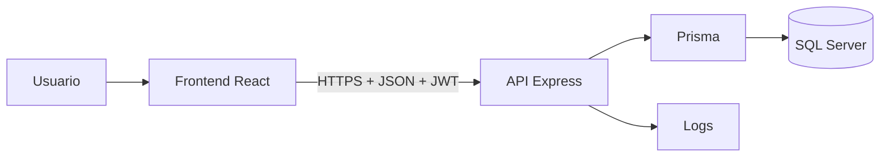

# Seguridad implementada en PASP

Este documento recoge los mecanismos de seguridad presentes actualmente en el
código de PASP. Su alcance es descriptivo: explica cómo protege la aplicación
la autenticación, los permisos, los datos, las peticiones y las operaciones
sensibles.


## Resumen de mecanismos

| Mecanismo | Finalidad |
| --- | --- |
| Hash de contraseñas con bcrypt | Evitar el almacenamiento de contraseñas en texto plano. |
| Cambio obligatorio en el primer acceso | Sustituir la contraseña temporal entregada al crear una cuenta. |
| JWT firmado y con caducidad | Identificar al usuario en las peticiones protegidas. |
| Autenticación en la API | Rechazar peticiones sin una credencial válida. |
| Autorización por roles | Separar las funciones de administradores, tutores y becarios. |
| Validación mediante Zod | Comprobar cuerpos, parámetros y tipos antes de procesarlos. |
| Prisma ORM | Ejecutar consultas parametrizadas y centralizar el acceso a SQL Server. |
| Restricciones SQL | Mantener la integridad de relaciones y valores únicos. |
| Helmet | Añadir cabeceras defensivas a las respuestas de la API. |
| CORS configurable | Limitar los orígenes web autorizados para utilizar la API. |
| Límite de intentos de acceso | Reducir intentos repetidos contra el login. |
| Errores centralizados | Ofrecer respuestas uniformes y controlar la información expuesta. |
| Identificador de petición | Relacionar una respuesta con su registro técnico. |
| Logs separados y rotatorios | Registrar actividad de autenticación y errores. |
| Variables de entorno | Mantener credenciales y secretos fuera del código fuente. |
| Salvaguardas en semillas | Evitar operaciones accidentales contra una base equivocada. |
| Pruebas de permisos | Comprobar automáticamente varias reglas de acceso. |

## Información protegida

PASP gestiona diferentes categorías de información:

- Identidad y datos de contacto.
- Información académica.
- Datos relativos al período de prácticas.
- Asignaciones entre tutores y becarios.
- Tareas e historial de cambios.
- Fichajes y horas imputadas.
- Evaluaciones y comentarios.
- Credenciales y metadatos de autenticación.
- Información técnica registrada en logs.

El acceso a estos datos se realiza a través de la API. El frontend no se conecta
directamente a SQL Server.



## Contraseñas

### Almacenamiento

Las contraseñas se procesan con bcrypt antes de guardarse:

- El backend utiliza un factor de trabajo de 10.
- bcrypt genera una sal para cada hash.
- La base de datos almacena `passwordHash`, no la contraseña original.
- La comparación de credenciales se realiza mediante `bcrypt.compare`.
- Las respuestas de autenticación no incluyen el hash.

### Primer acceso

Al crear un usuario:

1. La interfaz genera una contraseña temporal.
2. El usuario queda marcado mediante `primerAcceso=true`.
3. Después del primer login, PASP muestra obligatoriamente la pantalla de cambio
   de contraseña.
4. El usuario debe introducir la contraseña actual y confirmar la nueva.
5. El backend vuelve a generar el hash y establece `primerAcceso=false`.

Cuando un administrador restablece la contraseña de una cuenta a una nueva
contraseña temporal, el backend vuelve a establecer `primerAcceso=true`. De
este modo, el siguiente inicio de sesión exige sustituir la contraseña temporal
antes de permitir el acceso al resto de la aplicación.

La interfaz guía al usuario mediante una lista visual de requisitos. El backend
realiza su propia comprobación de longitud y composición antes de aceptar el
cambio.

### Superadministrador inicial

El script de creación del superadministrador:

- Obtiene correo, contraseña, nombre y apellidos desde variables privadas.
- Comprueba el formato del correo.
- Exige una contraseña temporal de al menos doce caracteres, con mayúscula,
  minúscula, número y símbolo.
- Comprueba que no exista ya otro superadministrador.
- Comprueba que el correo no esté ocupado.
- Aplica bcrypt antes de guardar la cuenta.
- Marca la cuenta para cambiar la contraseña en su primer acceso.

## Autenticación mediante JWT

Después de comprobar las credenciales, la API emite un JWT firmado con
`JWT_SECRET`.

El token contiene:

- Identificador del usuario.
- Correo.
- Rol.
- Indicador de superadministrador.
- Indicador de sesión demo, cuando corresponde.
- Fecha de expiración generada por la librería.

La duración privada se configura mediante `JWT_EXPIRES_IN`, con un valor
predeterminado de `2h`. Los tokens públicos se identifican como demo y utilizan
`DEMO_JWT_EXPIRES_IN`, cuyo valor predeterminado es `30m`.

En cada ruta protegida:

1. El frontend envía `Authorization: Bearer <token>`.
2. `authenticateToken` extrae el token.
3. `jsonwebtoken` comprueba la firma y la caducidad.
4. Los datos verificados se incorporan a la petición.
5. La operación continúa hacia los controles de rol.

Un token ausente, incorrecto o caducado produce una respuesta `401`.

## Gestión de la sesión en el frontend

El frontend guarda el JWT y los datos básicos del usuario en `sessionStorage`.
Esto permite restaurar la sesión al recargar la página, la aísla en la pestaña
actual y la elimina cuando esta se cierra.

La aplicación:

- Comprueba localmente la fecha de expiración antes de realizar una petición.
- Añade automáticamente el JWT a las peticiones autenticadas.
- Reacciona globalmente ante respuestas `401`.
- Elimina el token y los datos del usuario al cerrar la sesión.
- Elimina la sesión cuando detecta un JWT caducado o mal formado.
- Muestra un aviso de sesión expirada.
- Redirige de nuevo al login.

La comprobación local agiliza la experiencia, mientras que la comprobación de
firma válida se realiza siempre en el backend.

## Autorización

### Roles

PASP reconoce:

```text
Administrador
Tutor_Empresa
Tutor_Academico
Becario
```

Las rutas Express combinan:

- `authenticateToken`, que identifica al usuario.
- `requireRole`, que comprueba los roles autorizados.
- Middlewares específicos para administrador, tutor de empresa, tutor académico
  y becario.

El frontend utiliza `ProtectedRoute` para dirigir a cada usuario hacia su panel
y mostrar un aviso si intenta abrir una pantalla de otro rol. La API repite la
comprobación antes de realizar la operación.

### Separación funcional

- El administrador gestiona usuarios, perfiles y asignaciones.
- El tutor de empresa trabaja con sus becarios.
- El tutor académico consulta sus asignaciones en modo de solo lectura.
- El becario accede a su perfil, tareas y fichajes.

Los servicios aplican comprobaciones sobre el usuario autenticado y las
relaciones con los recursos solicitados.

### Protección administrativa

El sistema incorpora reglas específicas:

- Un superadministrador no puede eliminarse desde la gestión ordinaria.
- Un administrador no puede eliminar su propia cuenta.
- Las operaciones administrativas requieren autenticación y rol autorizado.
- La activación, desactivación y eliminación se realizan mediante endpoints
  protegidos.

### Modo de demostración

Cuando `PASP_DEMO_MODE=true`, el servidor ofrece cuatro accesos públicos por rol
sin enviar correos ni contraseñas al navegador. Estos accesos reciben un JWT con
el indicador `demo` y pueden consultar los datos ficticios autorizados.

Las peticiones `POST`, `PUT`, `PATCH` y `DELETE` de una sesión demo se rechazan
en el middleware de autenticación antes de ejecutar el controlador. Además, el
modo demo aplica el mismo bloqueo a las cuentas ordinarias de la base publicada,
aunque intenten iniciar sesión con contraseña. La cuenta superadministradora
privada conserva todos sus permisos.

El superadministrador no aparece en listados, detalles ni estadísticas de una
sesión demo. Los tutores de empresa solo pueden consultar los fichajes y demás
recursos de sus becarios asignados.

## Validación de entradas

El backend utiliza esquemas Zod para validar:

- Identificadores numéricos.
- Datos de usuario.
- Datos personales y académicos del becario.
- Asignaciones de tutores.
- Tareas y cambios de estado.
- Evaluaciones y puntuaciones.
- Fechas y rangos numéricos.

El middleware de validación:

1. Ejecuta `safeParse` sobre el cuerpo, los parámetros o la consulta.
2. Detiene la petición si los datos no son válidos.
3. Devuelve una lista estructurada de campos y errores.
4. Sustituye los datos originales por el resultado normalizado.

El frontend también valida formularios para ofrecer información inmediata al
usuario. El backend mantiene la validación definitiva.

## Acceso a la base de datos

Prisma centraliza las consultas de la aplicación y utiliza parámetros para los
valores enviados a SQL Server.

La única consulta SQL directa presente es una consulta constante de
disponibilidad:

```sql
SELECT 1 AS ready
```

El esquema Prisma define:

- Claves primarias.
- Claves foráneas.
- Campos obligatorios y opcionales.
- Longitudes de texto.
- Índices.
- Restricciones únicas.
- Acciones de borrado y actualización.

Entre las reglas de integridad se encuentran:

- Correo único por usuario.
- Un único perfil de becario por usuario.
- Un único fichaje diario por becario.
- Asignaciones de tutoría no duplicadas por tipo y estado.
- Relaciones obligatorias entre tareas, becarios y tutores.
- Historial vinculado a la tarea y al usuario que realiza el cambio.

Las operaciones que sustituyen varias asignaciones utilizan transacciones
Prisma para aplicar el conjunto de cambios como una unidad.

## Seguridad HTTP

### Helmet

La API utiliza Helmet como middleware global. Helmet incorpora cabeceras HTTP
defensivas antes de devolver las respuestas de Express.

### CORS

`FRONTEND_URL` permite configurar uno o varios orígenes separados por comas.
En producción, la API se niega a arrancar si no existe al menos un origen
configurado.
Cuando existe una lista:

- Se normalizan los orígenes configurados.
- El origen recibido se compara con la lista.
- Los orígenes no incluidos son rechazados.
- Se permiten peticiones sin origen, necesarias para determinados clientes no
  basados en navegador.

La configuración admite credenciales y se aplica antes de registrar las rutas.

### Límites de peticiones

Todas las rutas bajo `/api` admiten un máximo de 300 peticiones por dirección IP
dentro de una ventana de quince minutos.

El endpoint de acceso permite diez intentos por dirección IP dentro de una
ventana de quince minutos.

El middleware:

- Normaliza direcciones IPv4 e IPv6.
- Emite cabeceras estándar de rate limiting.
- Devuelve el código `RATE_LIMIT_EXCEEDED` al superar el límite.
- Se desactiva únicamente cuando `NODE_ENV=test`.

En producción, Express se configura para reconocer el primer proxy anterior y
obtener la dirección del cliente en ese contexto.

## Errores y respuestas

La API utiliza un manejador centralizado para:

- Convertir errores conocidos en códigos HTTP.
- Mantener una forma de respuesta uniforme.
- Ocultar el mensaje interno en errores inesperados del servidor.
- Adjuntar detalles solo cuando corresponda.
- Incluir la traza únicamente en desarrollo.
- Registrar método, ruta, código e identificador de petición.

Formato general de error:

```json
{
  "success": false,
  "code": "CODIGO_DE_ERROR",
  "message": "Descripción controlada",
  "details": {}
}
```

Las respuestas correctas utilizan igualmente un formato uniforme con
`success`, `message` y `data`.

## Identificadores de petición

`requestIdMiddleware`:

- Acepta un `x-request-id` recibido o genera un UUID.
- Añade el identificador a la petición.
- Lo devuelve en la cabecera de respuesta.
- Permite incluirlo en los logs de error.

Esto facilita relacionar el error observado por el cliente con el registro
técnico correspondiente.

## Logs

Winston gestiona:

- Logs generales.
- Logs de error.
- Logs de autenticación.
- Rotación diaria de archivos en desarrollo.
- Tamaño máximo de 20 MB por archivo.
- Retención de 30 días.
- Salida adicional por consola durante el desarrollo.
- Salida estándar en producción.

Los accesos correctos y fallidos registran datos de contexto como correo, rol,
IP y fecha. Los errores registran mensaje, stack y contexto técnico.

Los directorios y archivos de logs están excluidos del repositorio mediante
`.gitignore`.

## Variables de entorno y secretos

La API exige al arrancar:

```text
DATABASE_URL
JWT_SECRET
```

También admite:

```text
NODE_ENV
PORT
FRONTEND_URL
JWT_EXPIRES_IN
DEMO_JWT_EXPIRES_IN
PASP_DEMO_MODE
```

Los archivos privados `.env`, `.env.e2e`, `.env.bootstrap`,
`.env.seed.azure` y otras variantes locales están excluidos de Git. El
repositorio contiene plantillas con marcadores ficticios.

Los datos de bootstrap y semillas se cargan desde archivos de entorno
específicos. El directorio `.seed-private`, utilizado para informes de usuarios
de demostración, también está ignorado.

`VITE_API_URL` se utiliza exclusivamente para indicar al frontend la dirección
de la API y no contiene credenciales.

## Salvaguardas de semillas y pruebas

### Semilla de demostración

La aplicación de datos de demostración requiere:

- Una confirmación literal.
- El servidor esperado.
- El nombre esperado de la base.
- Coincidencia entre el destino configurado y el autorizado.

La semilla dispone de modos separados para planificar, aplicar y verificar. Al
aplicarla genera una contraseña aleatoria distinta para cada cuenta, almacena
solo su hash y descarta el valor en claro. En el entorno publicado estas cuentas
se abren exclusivamente mediante el endpoint de acceso demo.

### Entorno E2E

Las utilidades de limpieza de fichajes, tareas y evaluaciones solo se ejecutan
cuando:

- `NODE_ENV=test`.
- La base se llama exactamente `PASP_E2E_DB`.

La utilidad que cambia asignaciones E2E limita igualmente los usuarios sobre
los que puede actuar.

### Creación del superadministrador

El bootstrap comprueba que no exista un superadministrador ni un usuario con el
mismo correo antes de insertar la cuenta. Si alguna condición no se cumple, se
detiene sin modificarla.

## Pruebas relacionadas con seguridad

El backend contiene pruebas automatizadas para:

- Tokens válidos, inválidos y caducados.
- Contraseñas y hashing.
- Middleware de autenticación.
- Permisos por rol.
- Rutas reservadas a administradores.
- Rutas de tutor de empresa.
- Acceso de tutor académico.
- Acceso del becario.
- Rate limiting y normalización de IP.
- Validaciones Zod.
- Gestión uniforme de errores.
- Reintentos controlados ante indisponibilidad de la base.

El frontend contiene pruebas para:

- Inicio de sesión.
- Cambio de contraseña.
- Protección de rutas.
- Expiración de la sesión.
- Manejo de errores de API.
- Componentes y formularios que validan entradas.

Los recorridos Playwright incluyen un caso en el que un becario intenta acceder
al panel de administración y se comprueba el rechazo.

## Archivos principales

| Área | Archivo |
| --- | --- |
| Variables de entorno | `backend/src/config/env.ts` |
| Hash de contraseñas | `backend/src/utils/password.util.ts` |
| JWT | `backend/src/utils/jwt.util.ts` |
| Autenticación | `backend/src/middlewares/auth.middleware.ts` |
| Roles | `backend/src/middlewares/role.middleware.ts` |
| Rate limiting | `backend/src/middlewares/rate-limit.middleware.ts` |
| CORS | `backend/src/config/cors.ts` |
| Logs | `backend/src/config/logger.ts` |
| Errores | `backend/src/middlewares/error-handler.middleware.ts` |
| Validación | `backend/src/shared/validation` |
| Acceso a datos | `backend/src/database/prisma.ts` |
| Modelo de datos | `backend/prisma/schema.prisma` |
| Sesión del frontend | `frontend/src/shared/api/api.ts` |
| Contexto de autenticación | `frontend/src/features/auth/context/AuthContext.tsx` |

## Mantenimiento de dependencias

Las actualizaciones de seguridad se revisan por proyecto y se registran en los
archivos de bloqueo generados por npm. Un informe sin avisos conocidos no
sustituye la validación del comportamiento antes de publicar los cambios.

### Dependencia pendiente de Prisma

Prisma 6.19.3 depende de `@prisma/config` 6.19.3, que fija `deepmerge-ts` en
7.1.5. El aviso [GHSA-ggr8-5vv4-36mx](https://github.com/advisories/GHSA-ggr8-5vv4-36mx)
afecta a versiones anteriores a 8.0.0 y describe agotamiento de pila al fusionar
grafos de objetos con referencias circulares.

PASP no importa directamente esta biblioteca ni contiene un archivo
`prisma.config.ts`. Esto limita el uso observado, pero no elimina la dependencia
ni permite afirmar que la alerta esté resuelta. La biblioteca forma parte de la
cadena de configuración de Prisma; también puede intervenir en herramientas de
instalación y administración.

La versión 8 introduce cambios incompatibles, descritos en sus
[notas de publicación](https://github.com/RebeccaStevens/deepmerge-ts/releases/tag/v8.0.0).
No se fuerza mediante `overrides` ni se retrocede Prisma para silenciar el
informe. Queda pendiente una solución compatible y validada en generación del
cliente, configuración y operaciones de Prisma. GitHub descartó automáticamente
la alerta mediante la regla para avisos de bajo impacto en dependencias de
desarrollo. Ese estado no corrige la dependencia: el aviso sigue pendiente
técnicamente.