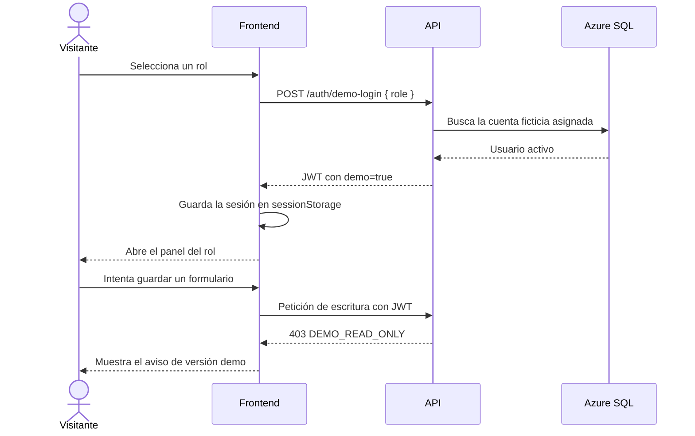

# SPEC-022: Acceso público de demostración en modo de solo lectura

> **Estado:** implementada
>
> **Ámbito:** frontend, API, autenticación y datos de demostración
>
> **Tipo de documento:** reconstrucción retrospectiva de una funcionalidad real
>
> **Fecha de reconstrucción:** 2026-09-28

## Propósito del documento

Esta especificación muestra cómo se estructura el trabajo en PASP mediante
**spec driven development**: primero se define el comportamiento observable, las
reglas y los criterios de aceptación; después se conecta cada requisito con su
implementación.

Se ha redactado retrospectivamente a partir de la versión ya implementada. Su
objetivo es ofrecer un ejemplo verificable del método de trabajo sin afirmar que
este archivo concreto precedió históricamente al código.

## Contexto

PASP se utiliza como demostración pública para presentar el proyecto profesionalmente. La
persona que llega desde un currículum debe poder explorar la aplicación sin
solicitar credenciales y sin modificar la información compartida con otros
visitantes.

La aplicación tiene cuatro perfiles funcionales:

- Administrador.
- Tutor de empresa.
- Tutor académico.
- Becario.

También existe una cuenta privada de superadministración que debe conservar
todos sus permisos y nunca debe exponerse como acceso público.

## Objetivo

Permitir el acceso directo a una sesión representativa de cada rol mediante
datos ficticios, manteniendo los formularios explorables y aplicando el bloqueo
de escritura en la API.

## Fuera de alcance

- Crear una copia aislada de la base por visitante.
- Permitir cambios temporales que se reviertan automáticamente.
- Publicar credenciales de cuentas de demostración.
- Exponer la cuenta superadministradora en el selector público.
- Convertir la demo en un entorno válido para datos personales reales.

## Historias de usuario

### HU-01. Elegir un perfil

Como visitante, quiero elegir uno de los cuatro perfiles disponibles para
entender la experiencia de cada participante sin conocer un correo o una
contraseña.

### HU-02. Explorar formularios

Como visitante, quiero abrir y completar formularios para conocer el alcance del
producto, aunque sus cambios no se guarden.

### HU-03. Recibir una explicación clara

Como visitante, quiero saber por qué no se ha aplicado un cambio para distinguir
el comportamiento intencionado de un error del sistema.

### HU-04. Mantener la administración privada

Como propietario, quiero que la cuenta superadministradora conserve la capacidad
de mantenimiento mediante credenciales privadas sin quedar visible para los
visitantes.

## Requisitos funcionales

| ID | Requisito |
| --- | --- |
| RF-01 | La pantalla de acceso debe alternar entre el formulario de credenciales y el selector de perfiles demo. |
| RF-02 | El selector debe mostrar Administrador, Tutor de empresa, Tutor académico y Becario. |
| RF-03 | Cada opción debe enviar únicamente el rol solicitado; el frontend no debe contener credenciales demo. |
| RF-04 | La API debe resolver cada rol a una cuenta ficticia representativa. |
| RF-05 | El acceso demo solo debe estar disponible cuando `PASP_DEMO_MODE=true`. |
| RF-06 | Tras el acceso, la aplicación debe dirigir al panel correspondiente al rol. |
| RF-07 | Los formularios deben permanecer accesibles para permitir su exploración. |
| RF-08 | Todo intento de escritura demo debe devolver un error específico y mostrarse en un aviso global. |
| RF-09 | El formulario tradicional de credenciales debe seguir disponible. |

## Reglas de seguridad

| ID | Regla |
| --- | --- |
| RS-01 | Los tokens emitidos por el acceso público deben incluir la marca `demo`. |
| RS-02 | Los tokens demo deben utilizar una caducidad independiente, de 30 minutos por defecto. |
| RS-03 | Las peticiones `POST`, `PUT`, `PATCH` y `DELETE` de una sesión demo deben rechazarse antes de ejecutar el controlador. |
| RS-04 | Con el modo demo activo, cualquier cuenta ordinaria autenticada con contraseña debe quedar también en modo de solo lectura. |
| RS-05 | Una cuenta con rol Administrador solo queda exceptuada del bloqueo si además tiene `esSuperAdmin=true`. |
| RS-06 | El superadministrador no debe aparecer en listados, detalles ni estadísticas consultados desde una sesión demo. |
| RS-07 | El acceso público administrativo debe rechazarse si la base contiene cuentas ordinarias ajenas al dominio ficticio autorizado. |
| RS-08 | Las contraseñas demo deben generarse aleatoriamente al aplicar la semilla; solo se almacena el hash y el valor en claro se descarta. |
| RS-09 | La sesión del navegador debe almacenarse en `sessionStorage` y quedar limitada a la pestaña actual. |

## Requisitos de experiencia de usuario

| ID | Requisito |
| --- | --- |
| UX-01 | El acceso con credenciales debe ser la vista inicial. |
| UX-02 | Un enlace «Explora la aplicación (demo) →» debe abrir el selector de perfiles. |
| UX-03 | El selector debe presentar los cuatro perfiles en una cuadrícula de dos columnas cuando haya espacio. |
| UX-04 | Cada perfil debe explicar brevemente qué parte del sistema permite consultar. |
| UX-05 | Durante el acceso deben mostrarse estados diferenciados para autenticación y arranque de la base de datos. |
| UX-06 | Cuando la API bloquee una escritura, debe aparecer un diálogo con el título «Versión de demostración» y una explicación. |
| UX-07 | Los errores de conexión o acceso deben aparecer dentro de la tarjeta activa sin alterar su estructura. |

## Requisitos operativos

| ID | Requisito |
| --- | --- |
| RO-01 | La base pública debe contener exclusivamente datos ficticios del dominio `pasp-demo.test`, además de la cuenta privada de superadministración. |
| RO-02 | La semilla debe ofrecer operaciones separadas para planificar, aplicar y verificar. |
| RO-03 | La API debe limitar el acceso a diez intentos de login por IP cada quince minutos. |
| RO-04 | La API debe aplicar un límite general de 300 peticiones por IP cada quince minutos. |
| RO-05 | En producción, la API debe exigir al menos un origen explícito en `FRONTEND_URL`. |

## Contrato de acceso demo

### Petición

```http
POST /api/v1/auth/demo-login
Content-Type: application/json

{
  "role": "Administrador"
}
```

Valores admitidos para `role`:

```text
Administrador
Tutor_Empresa
Tutor_Academico
Becario
```

### Respuesta correcta

La respuesta utiliza el mismo formato que el login ordinario:

```json
{
  "success": true,
  "data": {
    "token": "<jwt>",
    "user": {
      "rol": "Administrador",
      "esSuperAdmin": false,
      "primerAcceso": false
    }
  }
}
```

El JWT contiene `demo: true`; la respuesta nunca incluye una contraseña ni su
hash.

### Escritura bloqueada

Una petición de escritura autenticada como demo devuelve `403` con el código
`DEMO_READ_ONLY`. El mensaje indica que los cambios no se han aplicado.

## Flujo principal



## Criterios de aceptación

### CA-01. Acceso por cada rol

- **Dado:** el modo demo está activo y la base está preparada.
- **Cuando:** el visitante elige uno de los cuatro perfiles.
- **Entonces:** accede al panel correcto sin introducir credenciales.

### CA-02. Modo desactivado

- **Dado:** `PASP_DEMO_MODE=false`.
- **Cuando:** se solicita un acceso demo.
- **Entonces:** la API rechaza la petición y no emite ningún token.

### CA-03. Rol no permitido

- **Dado:** un valor de rol distinto de los cuatro admitidos.
- **Cuando:** se solicita un acceso demo.
- **Entonces:** la API responde con un error de validación.

### CA-04. Protección de escritura

- **Dada:** una sesión marcada como demo.
- **Cuando:** se realiza una petición `POST`, `PUT`, `PATCH` o `DELETE`
  protegida.
- **Entonces:** la API responde `403 DEMO_READ_ONLY` antes del controlador y no
  modifica la base de datos.

### CA-05. Consulta permitida

- **Dada:** una sesión demo válida.
- **Cuando:** se realiza una petición `GET` autorizada para su rol.
- **Entonces:** la API devuelve los datos ficticios correspondientes.

### CA-06. Superadministración privada

- **Dado:** el modo demo activo.
- **Cuando:** el superadministrador inicia sesión con sus credenciales privadas.
- **Entonces:** conserva todos los permisos de lectura y escritura.

### CA-07. Cuenta ordinaria mediante contraseña

- **Dado:** el modo demo activo.
- **Cuando:** una cuenta ordinaria ajena al dominio reservado para los perfiles
  públicos inicia sesión mediante el formulario tradicional.
- **Entonces:** su token queda marcado como demo y sus escrituras se bloquean.

### CA-08. Aviso visible

- **Dada:** una escritura bloqueada por la API.
- **Cuando:** el frontend recibe `DEMO_READ_ONLY`.
- **Entonces:** muestra el aviso global y conserva abierto el contexto del
  formulario.

### CA-09. Protección de la base publicada

- **Dada:** una base con una cuenta ordinaria ajena a `pasp-demo.test`.
- **Cuando:** se solicita el acceso demo administrativo.
- **Entonces:** la API rechaza el acceso público.

## Decisiones de diseño

### DD-01. Bloqueo en el backend

La interfaz no oculta los formularios porque son parte de la demostración. La
restricción se aplica en el middleware de autenticación, que constituye una
frontera efectiva aunque se llame directamente a la API.

### DD-02. Sesión demo identificable

La marca `demo` viaja dentro del JWT firmado. De esta manera no depende de un
estado manipulable enviado por separado desde el navegador.

### DD-03. Protección adicional por entorno

Cuando el modo demo está activo, el servidor trata como solo lectura a cualquier
cuenta que no sea superadministradora. Esta regla reduce el impacto de una
credencial ordinaria conocida o filtrada.

### DD-04. Credenciales resueltas en el servidor

El frontend solo conoce nombres de roles. La correspondencia con las cuentas
ficticias vive en el controlador y las contraseñas generadas por la semilla no
son necesarias para el acceso público.

### DD-05. Almacenamiento por pestaña

`sessionStorage` permite recargar la aplicación sin perder la sesión y elimina
la autenticación al cerrar la pestaña, una duración adecuada para una visita a la demo.

## Trazabilidad entre especificación e implementación

| Requisitos | Implementación principal |
| --- | --- |
| RF-01, RF-02, RF-03, RF-06, RF-09, UX-01 a UX-05 y UX-07 | `frontend/src/features/auth/components/Login.tsx` y `Login.module.css` |
| RF-03 y RF-04 | `frontend/src/features/auth/services/authService.ts`, `backend/src/controllers/demo.controller.ts` |
| RF-05 | `backend/src/config/env.ts`, `backend/src/controllers/demo.controller.ts` |
| RF-07, RF-08 y UX-06 | `frontend/src/shared/api/api.ts`, `frontend/src/shared/components/DemoNotice.tsx` |
| RS-01 a RS-05 | `backend/src/middlewares/auth.middleware.ts`, `backend/src/utils/jwt.util.ts`, `backend/src/services/auth.service.ts` |
| RS-06 | `backend/src/controllers/admin.controller.ts`, `backend/src/controllers/usuarios.controller.ts` y servicios asociados |
| RS-07 | `backend/src/controllers/demo.controller.ts` |
| RS-08, RO-01 y RO-02 | `backend/src/seeds/azureDemoSeed.ts` y `azureDemoSeed.data.ts` |
| RS-09 | `frontend/src/shared/api/api.ts` |
| RO-03 y RO-04 | `backend/src/middlewares/rate-limit.middleware.ts` |
| RO-05 | `backend/src/config/cors.ts` |

## Hitos de la implementación

Esta especificación es retrospectiva. El repositorio público parte de una copia
limpia; el historial original permanece privado. La tabla anterior permite
consultar el código que implementa cada requisito.

| Hito | Resultado |
| --- | --- |
| Acceso público | Sesiones demo y aviso de solo lectura. |
| Selector de perfiles | Presentación definitiva de los accesos por rol. |
| Seguridad | Aislamiento, caducidad, CORS, límites de peticiones y semilla. |
| Integración | Corrección de un hallazgo detectado en CI. |

## Definición de terminado

- Los cuatro perfiles pueden abrirse desde la URL pública sin credenciales.
- Ninguna credencial demo forma parte del frontend o de la documentación.
- Las consultas respetan el rol y las relaciones de asignación.
- Las escrituras demo se rechazan en la API y generan un aviso comprensible.
- El superadministrador conserva el mantenimiento privado completo.
- La base contiene exclusivamente datos ficticios y puede reconstruirse.
- La configuración pública utiliza tokens breves, CORS explícito y límites de
  peticiones.
- La documentación permite seguir cada requisito hasta su implementación.
